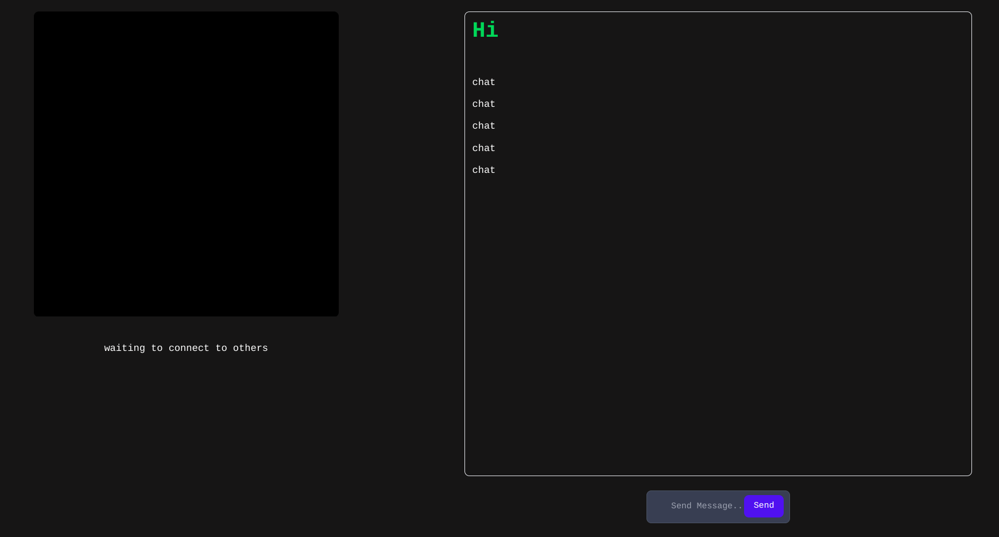

# 🎥 Omegle Clone - Connect with Strangers Online

Welcome to **Omegle Clone**! 🌐 This project replicates the functionalities of Omegle, allowing users to connect with strangers via video chat. Built with **React (Vite)**, **WebRTC**, and **Tailwind CSS**, this clone offers a seamless and modern video chat experience.

---

## 📸 Screenshots

> *(Replace the placeholder image with actual screenshots from your repository)*

---

## 🚀 Features

- 🔗 **Instant Connections**: Connect instantly with random strangers from around the world.
- 📹 **Video Chat**: High-quality video and audio streaming powered by WebRTC.
- 🎨 **Stylish UI**: Modern and responsive design using Tailwind CSS.
- 🔄 **Seamless Performance**: Optimized for low-latency and high-speed connections.

---

## 🛠️ Tech Stack

- **Frontend:** React (Vite) ⚛️
- **Styling:** Tailwind CSS 🎨
- **Real-time Communication:** WebRTC 📡

---
